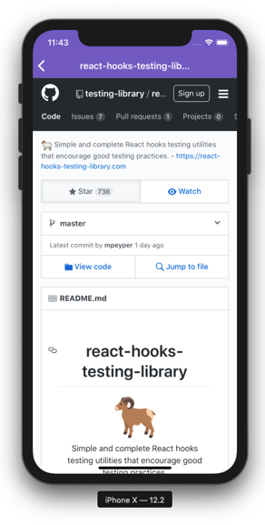

<h1 align="center">
    
</h1>

<h3 align="center">
  Desafio 6: Primeiro projeto com React Native
</h3>

<p align="center">“Só deseje as coisas as quais você está disposto a lutar”!</blockquote>

<p align="center">

  <a href="https://rocketseat.com.br">
    
  </a>

  
</p>

<p align="center">
  <a href="#rocket-sobre-o-desafio">Sobre o desafio</a>&nbsp;&nbsp;&nbsp;|&nbsp;&nbsp;&nbsp;
  <a href="#memo-licença">Licença</a>
</p>

## :rocket: Sobre o desafio

Neste desafio, desenvolvemos uma aplicação com React Native durante aulas do módulo e foi proposto como desafio adicionar funcionalidades à aplicação conforme descrito na seção abaixo. Esse repositório é a minha proposta de solução.

### Funcionalidades

#### 1. Loading de repositórios

Adicione um indicator de loading utilizando `<ActivityIndicator />` antes de carregar a lista de repositórios favoritados na tela de detalhes do Usuário.

#### 2. Scroll infinito

Adicione uma funcionalidade de scroll infinito na lista de repositórios favoritados. Assim que o usuário chegar nos **20%** do final de lista, busque pelos items na próxima página e adicione na lista. Seu código ficará da seguinte forma:

```js
<Stars
  onEndReachedThreshold={0.2} // Carrega mais itens quando chegar em 20% do fim
  onEndReached={this.loadMore} // Função que carrega mais itens
  // Restante das props
>
```

Para requisitar uma nova página no Github utilize um parâmetro `page` no fim da URL:

```
https://api.github.com/users/diego3g/starred?page=2
```

#### 3. Pull to Refresh

Adicione uma funcionalidade para quando o usuário arrastar a listagem de repositórios favoritados pra baixo atualize a lista resetando o estado, ou seja, volte o estado da paginação para a página 1 exibindo apenas os 30 primeiros itens.

A funcionalidade "Pull to Refresh" existe por padrão na FlatList e pode ser implementada através do seguinte código:

```js
<Stars
  onRefresh={this.refreshList} // Função dispara quando o usuário arrasta a lista pra baixo
  refreshing={this.state.refreshing} // Variável que armazena um estado true/false que representa se a lista está atualizando
  // Restante das props
>
```

#### 4. WebView

Crie uma nova página na aplicação que vai ser acessada quando o usuário clicar em um repositório favoritado, essa página deve conter apenas o Header da aplicação. O conteúdo da página será uma WebView, ou seja, um browser integrado que exibe o atributo `html_url` presente no objeto do repositório que vem da API do Github.

Documentação de utilização da [WebView](https://github.com/react-native-community/react-native-webview/blob/master/docs/Getting-Started.md).

Exemplo de código:

```js
<WebView source={{ uri: repository.html_url }} style={{ flex: 1 }} />
```

Resultado:



## Para testar o projeto

Faça o clone do repositório, instale as dependências.

```bash
git clone git@github.com:valdirmendesgt/bootcamp-gostack-primeiro-app-react-native.git
cd bootcamp-gostack-primeiro-app-react-native
yarn
```

Inicie o projeto na sua plataforma mobile:

### ios
```bash
react-native run-ios
```

### Android
```bash
react-native run-android
```

## :memo: Licença

Esse projeto está sob a licença MIT. Veja o arquivo [LICENSE](LICENSE) para mais detalhes.
